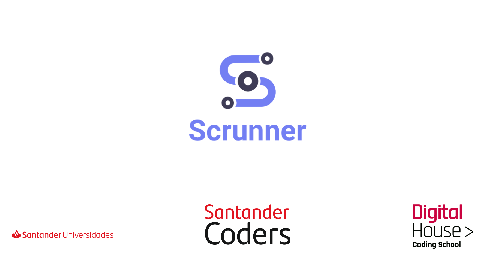
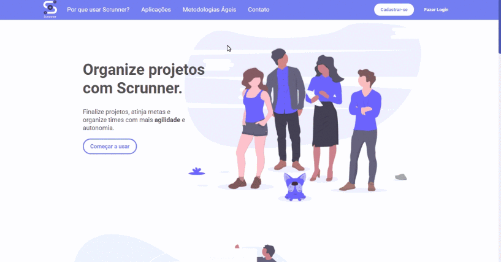
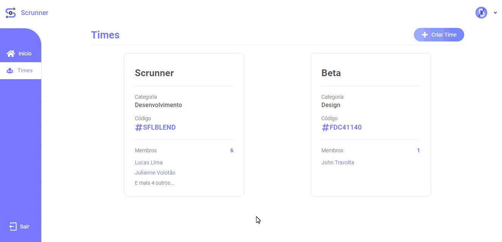
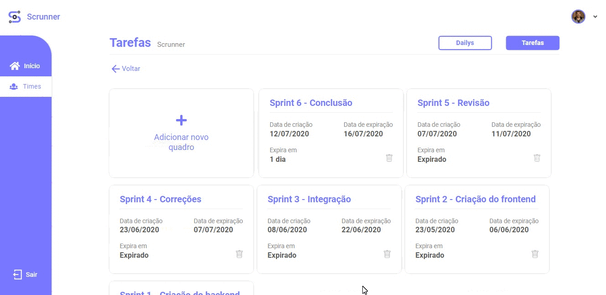
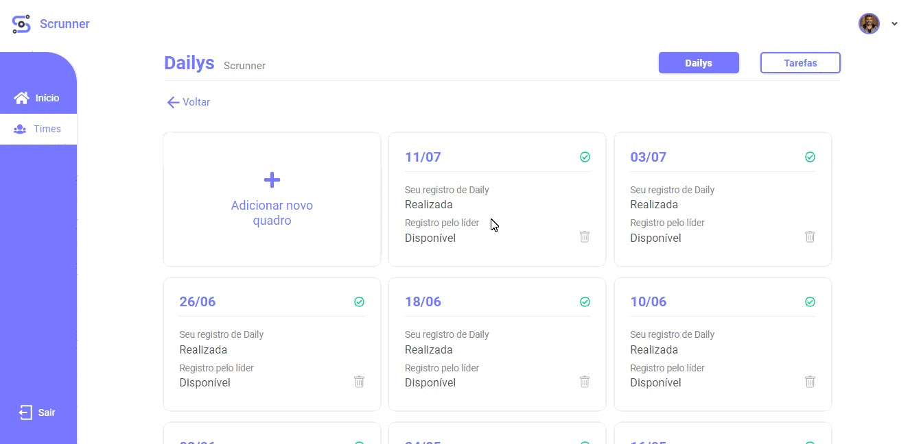

<p align="center" >
	
</p>

<h4  align="center">
	⚡ Scrunner
</h4>

<p  align="center">
<a  href="#coffe-santander-coders"> ☕ Santander Coders</a>&nbsp;&nbsp;&nbsp;|&nbsp;&nbsp;&nbsp;
	<a  href="#telescope-projeto">🔭 Projeto</a>&nbsp;&nbsp;&nbsp;|&nbsp;&nbsp;&nbsp
	<a  href="#computer-tecnologias"> 💻 Tecnologias</a>&nbsp;&nbsp;&nbsp;|&nbsp;&nbsp;&nbsp;
	<a  href="#-preview">💜 Preview</a>&nbsp;&nbsp;&nbsp;|&nbsp;&nbsp;&nbsp;
	<a  href="#-getting-started">🤠 Getting Started </a>&nbsp;&nbsp;&nbsp;|&nbsp;&nbsp;&nbsp;
	<a  href="#mortar_board-autores">🎓 Autores  </a>	
</p>

<br>

## :coffee: Santander Coders

Santander Coders é um programa educacional promovido pelo Santander em parceria com a Digital House no qual houve um processo seletivo onde os inscritos concorreram a 240 bolsas integrais de estudo para o curso de Desenvolvimento Web Full Stack.

<br>

### :books: Conteúdo do curso

#### :pencil: Tecnologias

- [MySQL](https://www.mysql.com/);

- [GIT](https://git-scm.com/);

- [HTML](https://developer.mozilla.org/pt-BR/docs/Web/HTML);

- [CSS](https://developer.mozilla.org/pt-BR/docs/Web/CSS);

- [JavaScript](https://developer.mozilla.org/pt-BR/docs/Web/JavaScript);

- [NodeJS](https://nodejs.org/en/);

- [React](https://pt-br.reactjs.org/).

#### :book: Soft Skills

- Metodologias Ágeis/Scrum;

- Github;

- Construção de portfólio;

- Desenvolvimento de carreira;

- Network.

<br>

## :telescope: Projeto

O Scrunner tem como objetivo incentivar e facilitar a utilização de metodologias ágeis através de uma interface intuitiva e dinâmica. Assim, seus usuários poderão se organizar em conjunto com seu time utilizando a plataforma para otimizar o processo de criação ou andamento de um projeto com ferramentas utilizadas no Scrum, como o Kanban e o processo de Dailys, além de gráficos estatísticos que mostram o progresso do time durante as sprints.

<br>

## :computer: Tecnologias

**:crystal_ball: Web**

- [React Js;](https://pt-br.reactjs.org/)

- [Axios.](https://github.com/axios/axios)

**:satellite: Backend**

- [NodeJs;](https://nodejs.org/en/)

- [Express;](https://www.express.com/)

- [Postgres;](https://www.postgresql.org/)

- [Jwt;](https://jwt.io/)

- [Multer;](https://www.npmjs.com/package/multer)

- [SqLite;](https://www.sqlite.org/index.html)

- [Jest.](https://jestjs.io/pt-BR/)

<br>

## 💜 Preview

<p  align="center">

</p>

<p  align="center">

</p>

<p  align="center">

</p>

<p  align="center">

</p>

## 🤠 Getting Started

Você precisa clonar o repositório digitando em seu terminal `$ git clone https://github.com/lucaslds94/Scrunner.git`.

### :satellite: Backend

> Para executar o backend, você irá necessitar do banco [Postgres](https://www.postgresql.org/) instalado em seu computador.

- Logo após clonar o repositório, navegue até a pasta backend `$ cd backend/` e execute o comando `yarn install` ou `npm install`.

- Dentro da pasta backend, abra o arquivo `example.env` e substitua seus valores pelas informações correspondentes ao seu banco de dados e ao e-mail que enviará a confirmação de conta. Logo após, renomeie o arquivo para `.env`.

- Após as dependências terminarem de ser instaladas, execute `$ yarn dbCreate` ou `$ npm run dbCreate`. Isso irá executar a criação do banco, então, após seu término, execute `$ yarn dbMigrate` ou `$ npm run dbMigrate`, pelo qual serão executadas as migrations e as seeders necessárias para o banco de dados.

> Caso deseje realizar os testes, execute `$ yarn test` ou `$ npm test`. Assim, será exibido em seu terminal o resultado dos testes.

- Logo após seguir os direcionamentos acima, execute o comando `yarn start` ou `npm start`. Apresentando assim, a mensagem abaixo em seu terminal.

```
[SERVER] Server running on port 3333
```

**:crystal_ball: Web**

Após seguir os passos anteriores, vá até a pasta `$ cd web/` e execute `$ yarn install` ou `$ npm install`.

Depois das dependências serem instaladas, execute o comando `$ yarn start` ou `$ npm run start`.

<br>

## :mortar_board: Autores

<table>
    <tr>
        <td align="center">
            <a href="https://github.com/juliannevolotao">
                
                <br />
                <sub><b>Julianne</b></sub>
            </a>
        </td>
        <td align="center">
            <a href="https://github.com/lucaslds94">
                
                <br />
                <sub><b>Lucas Lima</b></sub>
            </a>
        </td>
        <td align="center">
            <a href="https://github.com/Luuck4s">
                
                <br />
                <sub><b>Lucas Andrade</b></sub>
            </a>
        </td>
        <td align="center">
            <a href="https://github.com/lucaszarza">
                
                <br />
                <sub><b>Lucas Zarza</b></sub>
            </a>
        </td>
        <td align="center">
            <a href="https://github.com/mdrondado">
                
                <br />
                <sub><b>Maikom</b></sub>
            </a>
        </td>
    </tr>
</table>
