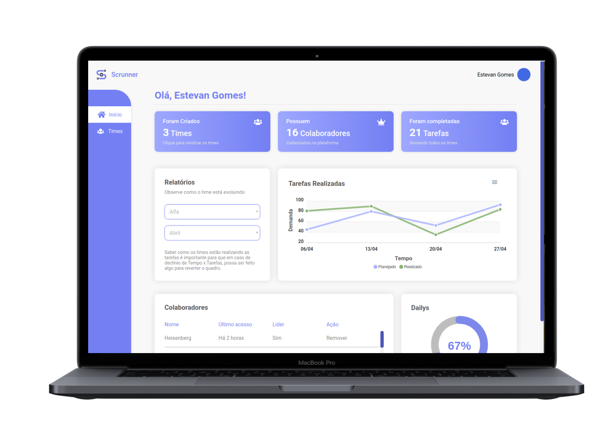
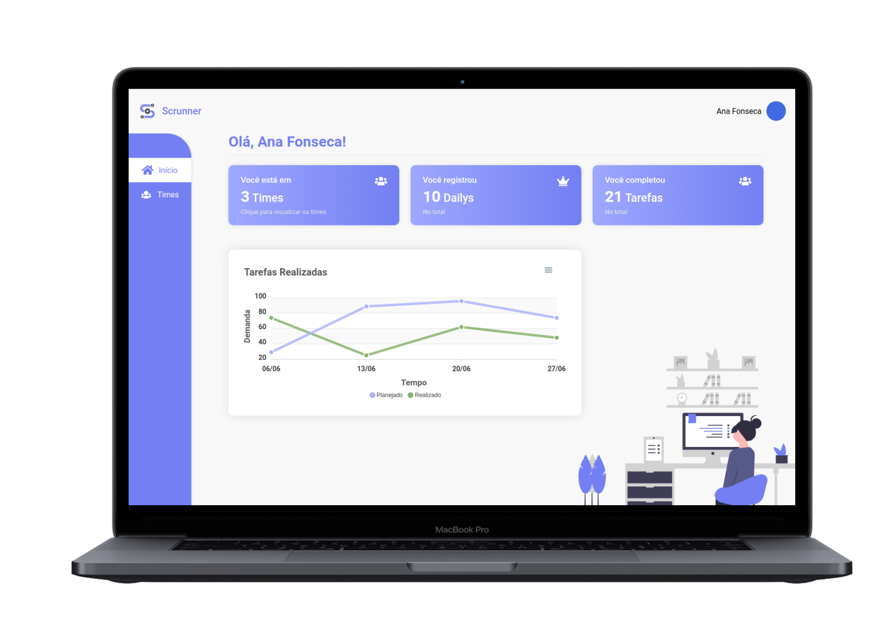
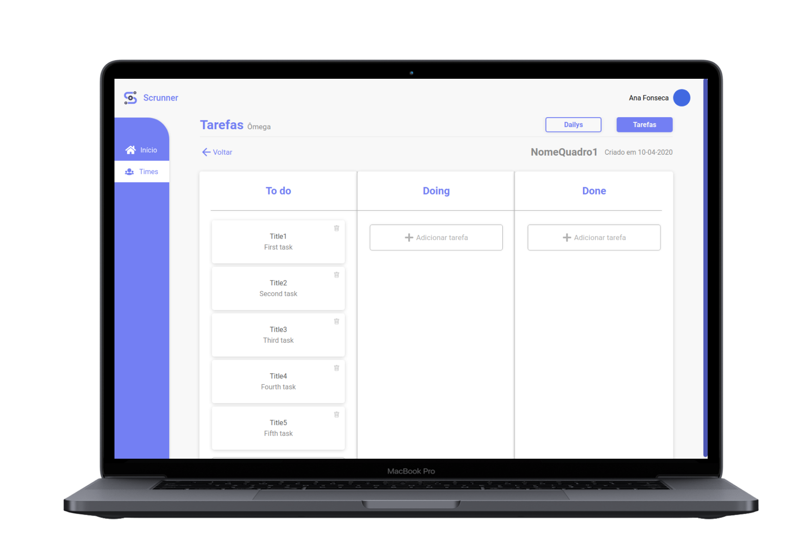

	

<h4  align="center">
	⚡ Scrunner
</h4>

<a  href="#coffe-santander-coders"> ☕ Santander Coders</a>&nbsp;&nbsp;&nbsp;|&nbsp;&nbsp;&nbsp;
	<a  href="#telescope-projeto">🔭 Projeto</a>&nbsp;&nbsp;&nbsp;|&nbsp;&nbsp;&nbsp
	<a  href="#computer-tecnologias"> 💻 Tecnologias</a>&nbsp;&nbsp;&nbsp;|&nbsp;&nbsp;&nbsp;
	<a  href="#-preview">💜 Preview</a>&nbsp;&nbsp;&nbsp;|&nbsp;&nbsp;&nbsp;
	<a  href="#-getting-started">🤠 Getting Started </a>&nbsp;&nbsp;&nbsp;|&nbsp;&nbsp;&nbsp;
	<a  href="#mortar_board-autores">🎓 Autores  </a>	

## :coffee: Santander Coders

Santander Coders é um programa educacional promovido pelo Santander em parceria com a Digital House no qual houve um processo seletivo onde 36 mil inscritos concorreram a 240 bolsas integrais de estudo para o curso de Desenvolvimento Web Full Stack.

###  :books: Conteúdo do curso  
	
#### :pencil: Tecnologias 

-  [MySQL](https://www.mysql.com/);

- [MongoDB](https://www.mongodb.com/);

-  [GIT](https://git-scm.com/);

- [HTML](https://developer.mozilla.org/pt-BR/docs/Web/HTML);

- [CSS](https://developer.mozilla.org/pt-BR/docs/Web/CSS);

- [JavaScript](https://developer.mozilla.org/pt-BR/docs/Web/JavaScript);

- [NodeJS](https://nodejs.org/en/);

-  [React](https://pt-br.reactjs.org/).

####  :book: Soft Skills
- Metodologias Ágeis/Scrum;

- Github;

- Construção de portfólio;

- Desenvolvimento de carreira;

- Network.

## :telescope: Projeto

// objetivo do projeto 

## :computer: Tecnologias

**:crystal_ball: Web**
 
- [React Js;](https://pt-br.reactjs.org/)

- [Axios.](https://github.com/axios/axios)
  

## 💜 Preview

## 🤠 Getting Started

Você precisa clonar o repositório e pode fazer isso digitando em seu terminal `$ git clone https://github.com/lucaslds94/Scrunner.git`.

### **:crystal_ball: Web**

Após seguir os passos acima vá para pasta  `$ cd web/`  e execute  `$ yarn install`  ou  `$ npm install`.

Depois das dependências terminarem de instalar execute o comando  `$ yarn start`  ou  `$ npm run start`.

## :mortar_board: Autores 

<table>
    <tr>
        <td align="center">
            <a href="https://github.com/juliannevolotao">
                
                 
                <b>Julianne</b>
            </a>
        </td>
        <td align="center">
            <a href="https://github.com/lucaslds94">
                
                 
                <b>Lucas Lima</b>
            </a>
        </td>
        <td align="center">
            <a href="https://github.com/Luuck4s">
                
                 
                <b>Lucas Andrade</b>
            </a>
        </td>
        <td align="center">
            <a href="https://github.com/lucaszarza">
                
                 
                <b>Lucas Zarza</b>
            </a>
        </td>
        <td align="center">
            <a href="https://github.com/mdrondado">
                
                 
                <b>Maikom</b>
            </a>
        </td>
    </tr>
</table>